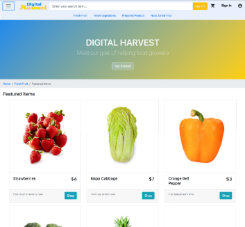
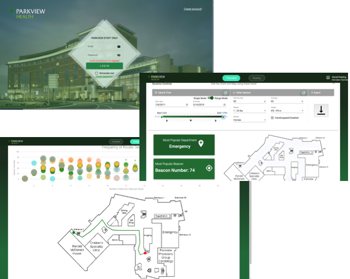
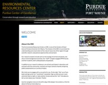
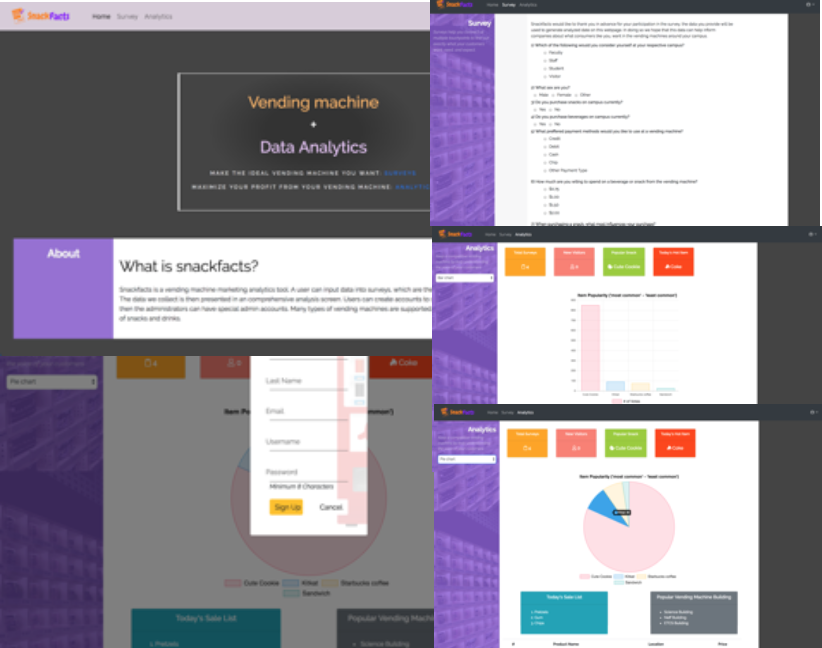
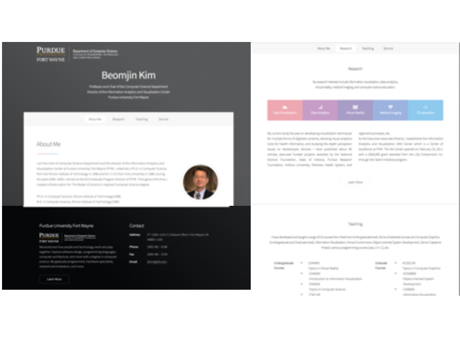
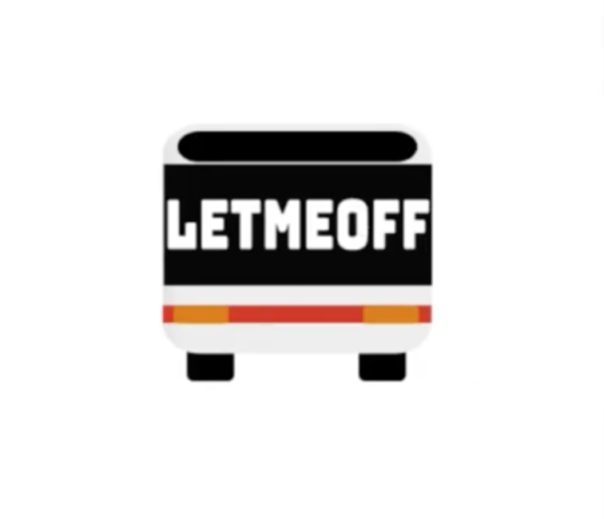
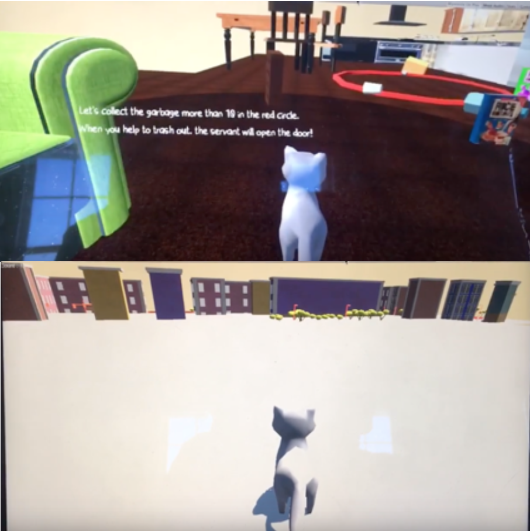
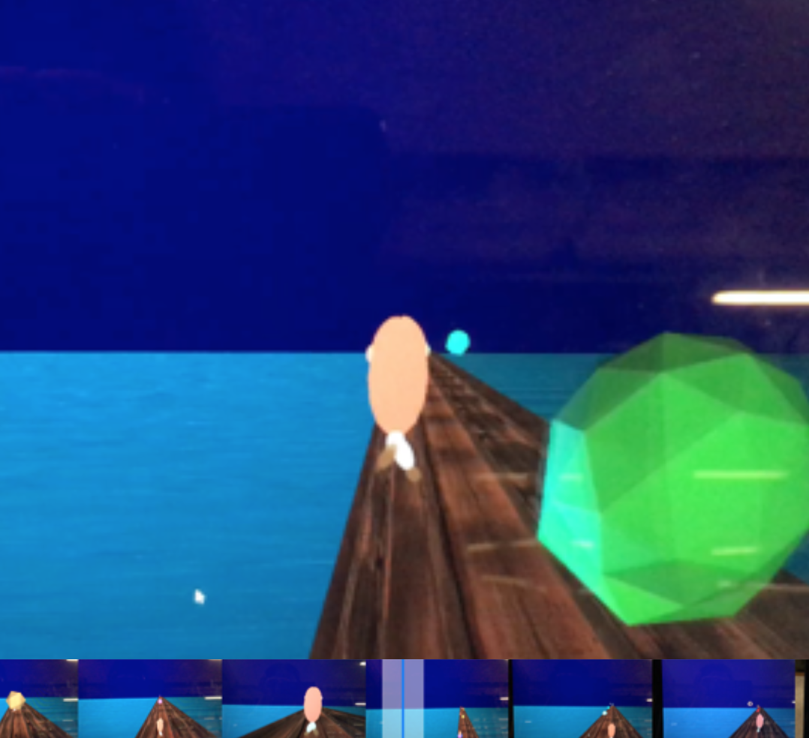

 

[Gmail](mailto://developer.haemin.ryu@gmail.com)
[Phone](tel:260-255-2983)
[GitHub](https://github.com/happygoals)
[Portfolio](https://happygoals.github.io/)

<section class="tiles">
		<article class="style1">
			
				
			
			<a href="https://github.com/mfwlr/DigitalHarvestTutorial">
				<h2>Digital Harvest</h2>
				

					
I have developed a web app to meet the goal of helping food growers through online market. 

				

			</a>
		</article>
		<article class="style2">
			
				
			
			<a href="https://github.com/happygoals/Team7_PFW_Capstone">
				<h2>Indoor Navigation : Improved Accessibility for People with Disabilities </h2>
				

					
This project include web development utilizing data and business analytics, targeted advertisements that will promote Parkview technologies, and improved mobile application navigation to assisted disabled patients.  

				

			</a>
		</article>
		<article class="style3">
			
				
			
			<a href="http://erc.pfw.edu/">
				<h2>Environment Resource Center</h2>
				

					
 Using Wordpress, I recreated the the Environmental Resource Center websites related in the department of the biology for Purdue rebranding, herpetofauna Education and Research Program website.

				

			</a>
		</article>
		<article class="style4">
			
				
			
			<a href="http://github.com/happygoals/web_app_dev_fall2018">
				<h2>Snackfacts</h2>
				

					
Snackfacts is a vending machine marketing analytics tool. A user can input data into survey, which are the saved into our database.  The data we collect is then presented in a comprehensive analysis screen. Users can create account to save data they enter, and then the administrators can have special admin accounts. 

				

			</a>
		</article>
		<article class="style5">
			
				
			
			<a href="generic.html">
				<h2>Professor's Personal Website</h2>
				

					
I developed several professors’ personal websites.

				

			</a>
		</article>
		<article class="style6">
			
				
			
			<a href="https://devpost.com/software/letmeoff-fhyj4w#">
				<h2>Let Me Off – Android(Java) </h2>
				
DemonHacks 2019

				

					
This mobile app is for the people(Sleepyheads, forgetful heads, travelers) who miss getting off the bus when they arrive at the right bus stop.

				

			</a>
		</article>
		<article class="style2">
			
				
			
			<a href="https://www.youtube.com/watch?v=DBUaVWYqFHM&feature=youtu.be">
				<h2>Cat Back Home – Unity(C#) </h2>
				

					
This is my first game development based on the real story of a cat living in a student housing that goes out to find her real home.

				

			</a>
		</article>
		<article class="style3">
			
				
			
			<a href="https://www.youtube.com/watch?v=RtuqlmzrMhc&feature=youtu.be">
				<h2>Run On the Bass– OpenGL(C) </h2>
				

					
This is a running game that the finger runs on the bass guitar.

				

			</a>
		</article>
		<article class="style1">
			
				
			
			<a href="#">
				<h2>Coming Soon..</h2>
				

					

				

			</a>
		</article>
		 
		 
</section>

