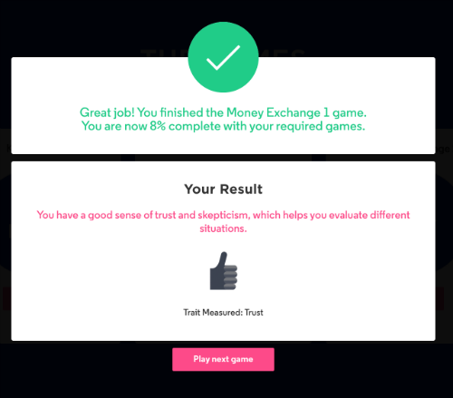
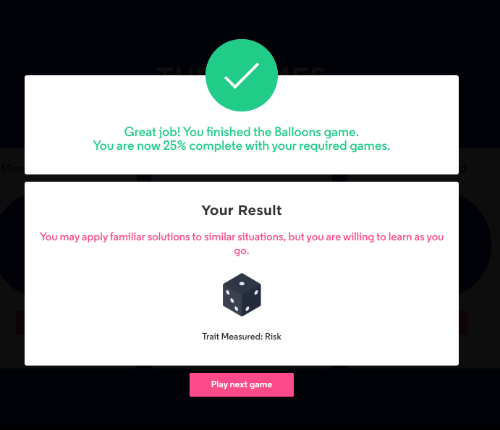
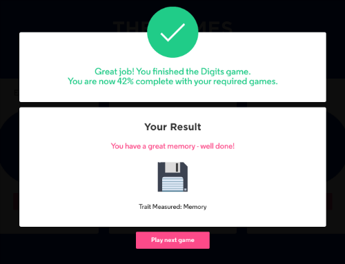
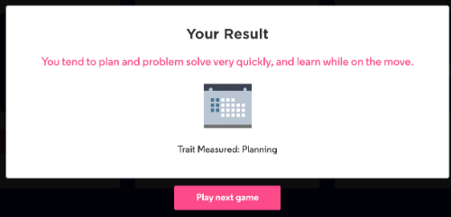

Through my application process for 2020 Software Engineer Program - Summer Internship Opportunity, I got to know myself better. By playing a series of 12 games to showcase my potential, beyond what I’ve submitted in my application and resume. This is powered by a program called pymetrics.

The pymetrics games are designed to be fun and simple, and should take no longer than 20-30 minutes to complete. Collectively, they will help the company get a better understanding of who I am as an individual, learn how I think, and determine the types of roles I'm most likely to succeed in. After I finished, I could view a personalized report. My completed pymetrics results will be considered by JPMorgan Chase for any position I apply to where pymetrics is a part of the application process. Pymetrics is supported on the following web browsers: Chrome, Safari, Firefox, IE 11. On mobile, you must be on a minimum of iOS 11 for Apple devices or 4.4 on Android devices. Pymetrics is not compatible with tablet devices. Learn more.. click [Pymetrics](https://www.pymetrics.com/employers/)

These are my most unique 3 categories:
1) EFFORT: I tend to work equally hard on all tasks,regardless of how much you expect to be rewarded by completing tasks
successfully.
2) RISK TOLERANCE: I tend to carefully test options and choose the safest method to achieve an objective.You also tend to be averse to negative outcomes.
3) ATTENTION: I tend to be methodical in the way you complete tasks and are often thorough and restrained.You may find
that you prefer to focus on accuracy over speed on tasks, and this may support you to avoid making mistakes.

Here is the report from Pymetrics: <a href="../assets/post/files/factor-trait-report_ryu-haemin.pdf" target="_blank">PDF.</a>

It is always fun to learn about myself! 

Here are some result images that I captured while playing the Pymetrics game: 

