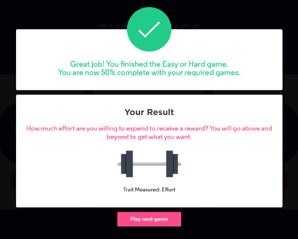
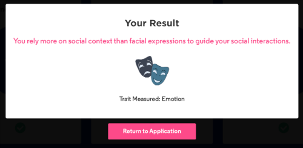

Through my application process for 2020 Software Engineer Program - Summer Internship Opportunity, I got to know myself better. By playing a series of 12 games to showcase my potential, beyond what I’ve submitted in your application and resume. This is powered by a program called pymetrics.

The pymetrics games are designed to be fun and simple, and should take no longer than 20-30 minutes to complete. Collectively, they will help the company get a better understanding of who you are as an individual, learn how you think, and determine the types of roles you’re most likely to succeed in. After you finished, I could view a personalized report. My completed pymetrics results will be considered by JPMorgan Chase for any position I apply to where pymetrics is a part of the application process. Pymetrics is supported on the following web browsers: Chrome, Safari, Firefox, IE 11. On mobile, you must be on a minimum of iOS 11 for Apple devices or 4.4 on Android devices. Pymetrics is not compatible with tablet devices.

Learn more.. click [Pymetrics](https://www.pymetrics.com/employers/)

Here is the report from Pymetrics: <a href="../assets/post/files/factor-trait-report_ryu-haemin.pdf" target="_blank">PDF.</a>

