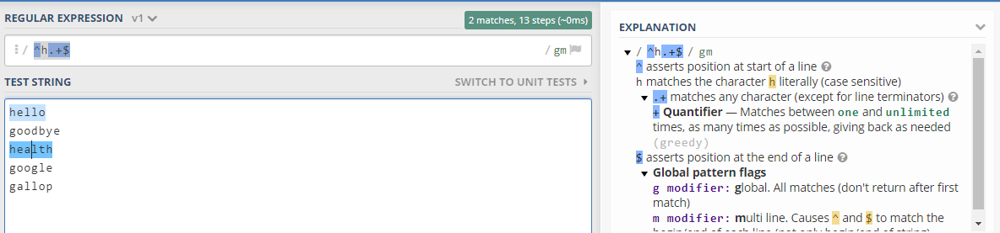
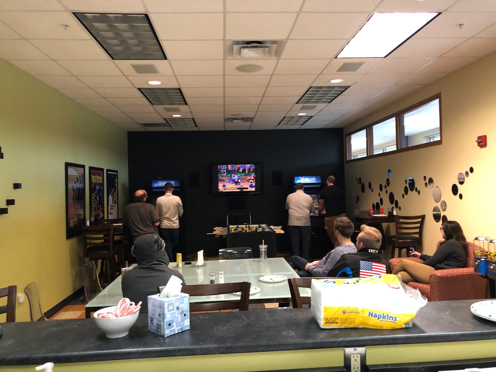
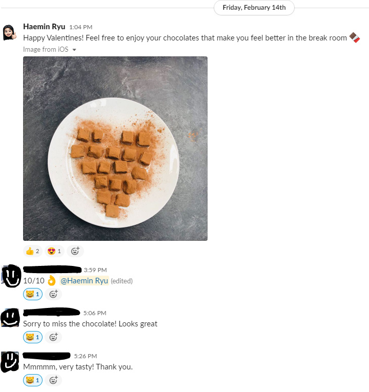

# Software Developer Internship

@ CirrusABS, Fort Wayne, IN. January 21st, 2020 - Current (1 month) 

## What the company is looking for in a Software Developer Intern:
* A passion for continual learning and the ability to pick up new technologies quickly
* Individuals with strong communication skills and the ability to respect the unique skills of your team
* Desire to work as part of a team, be part of a collaborative process and expand your own experience
* A problem-solving attitude within a team atmosphere

## Technical skills required for Software Engineer Internship:
* Pursuing a Computer Science, Software Engineering or related degree
* Entry-level experience in HTML5, Javascript, SQL, JSON and XML
* Object oriented development experience (.NET preferred)
* Experience developing front-end, back-end or both types of web application components

## Questions that I asked my supervisor on the First Day of Internship
1. What skills will I need to grow? 
2. How can i be a valuable team member? 
3. How will I fit into the culture? 
4. What do you want me to achieve in this internship program? 
5. What are the things you would like me to accomplish in my first week on the job?
6. How do you prefer to communicate, email or in person? 
7. How often would you like me to give you updates and progress reports? 

## How was my experience? 
I had watched the c# and .NET course video materials and implemented following projects. I simply went through the projects and use online resources to complete them as quickly as possible. My boss always welcomes to answer the questions and updated frequently the material and supplementary videos and slide. All employee are encouraged to have an hour training every morning. 

## Daily Scrum List 
* What did you do yesterday? 
* What will you work on today? 
* Do you have any obstacles?

## What I have learned so far

|  Duration   |         Date          |                                          My Tasks                                            |
|:------------|:----------------------|:---------------------------------------------------------------------------------------------|
|    Week1    | 1/21/2020 - 1/24/2020 | Reinforce C# fundamentals, C# Project1(File handling, array, unit tests, using classes)      |
|    Week2    | 1/27/2020 - 1/31/2020 | C# Project2(Interface, Form-based application using data-bound controls, unit tests, TDD)    |
|    Week3    |  2/3/2020 - 2/7/2020  | X Path Query, XSLT, XML, *Regex, URL Rewrites Rules, SEO Friendly URL, Cirrus Web Basics*     |
|    Week4    | 2/10/2020 - 2/14/2020 | WordPress Installation, C# Course Review, C# Project 3(Polymorphism), C# Project 4(MVC)      |
|    Week5    | 2/17/2020 - 2/21/2020 | C# Project 5(Inheritance, Polymorphism, Interface and abstract classes, utilize unit testing)|

* *Regex

* *Cirrus Web Developer Basics
1. Add your website to SVN and add a setup script and automatic deployment
2. Restore Local Website Database
3. Google Analytics
4. Configure, Create, and Apply a Macro
5. Wordpress Installation

## My first company event! 

We had been having our January company event on Friday the 31st. Company ordered pizza from Olie's. It was quite fancy and nice. They put together rules for a little game competition. We were playing arcade games at the breakroom. It was such a cool thing that we have a gaming machine at workplace. 

On valentine's day, I wanted to express my thanks with sharing the chocolates with my coworkers. I felt thankful and heartfelt with Cirrus people! 
