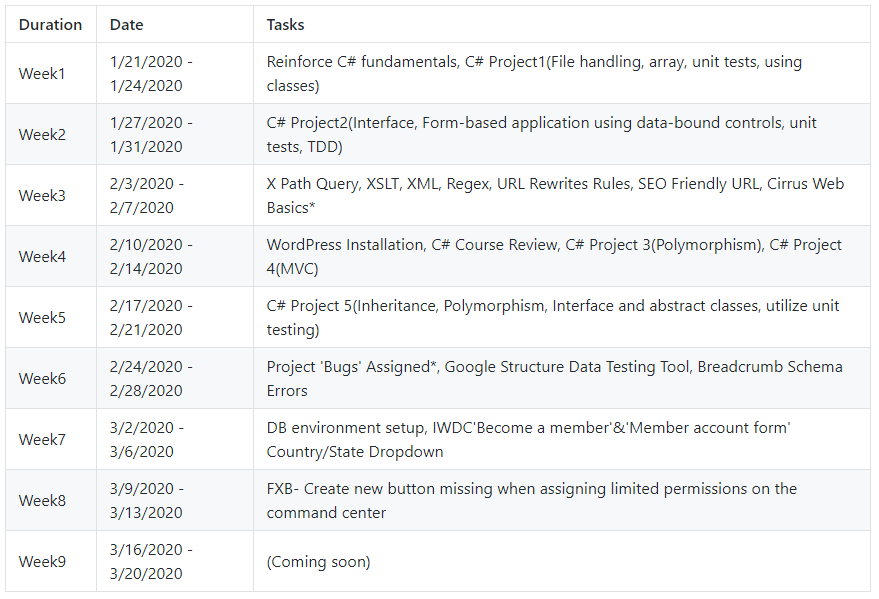
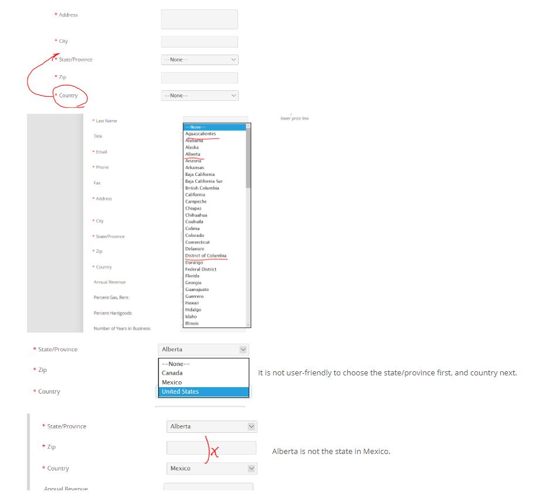

# Intern Program Brings Problem-solving Skills

## Questions that I asked my supervisor on the First Day of Internship
1. What skills will I need to grow? 
2. How can i be a valuable team member? 
3. How will I fit into the culture? 
4. What do you want me to achieve in this internship program? 
5. What are the things you would like me to accomplish in my first week on the job?
6. How do you prefer to communicate, email or in person? 
7. How often would you like me to give you updates and progress reports? 

## How was my experience? 
I had watched the c# and .NET course video materials and implemented following projects. I simply went through the projects and use online resources to complete them as quickly as possible. My boss always welcomes to answer the questions and updated frequently the material and supplementary videos and slide. All employee are encouraged to have an hour training every morning. 

## Daily Scrum List 
* What did you do yesterday? 
* What will you work on today? 
* Do you have any obstacles?

|  Duration   |         Date          |                                             Tasks                                            |
|:------------|:----------------------|:---------------------------------------------------------------------------------------------|
|    Week1    | 1/21/2020 - 1/24/2020 | Reinforce C# fundamentals, C# Project1(File handling, array, unit tests, using classes)      |
|    Week2    | 1/27/2020 - 1/31/2020 | C# Project2(Interface, Form-based application using data-bound controls, unit tests, TDD)    |
|    Week3    |  2/3/2020 - 2/7/2020  | X Path Query, XSLT, XML, Regex, URL Rewrites Rules, SEO Friendly URL, Cirrus Web Basics*     |
|    Week4    | 2/10/2020 - 2/14/2020 | WordPress Installation, C# Course Review, C# Project 3(Polymorphism), C# Project 4(MVC)      |
|    Week5    | 2/17/2020 - 2/21/2020 | C# Project 5(Inheritance, Polymorphism, Interface and abstract classes, utilize unit testing)|
|    Week6    | 2/24/2020 - 2/28/2020 | Project 'Bugs' Assigned*, Google Structure Data Testing Tool, Breadcrumb Schema Errors       |
|    Week7    |  3/2/2020 - 3/6/2020  | DB environment setup, IWDC'Become a member'&'Member account form' Country/State Dropdown     |
|    Week8    |  3/9/2020 - 3/13/2020 | FXB- Create new button missing when assigning limited permissions on the command center      |
|    Week9    | 3/16/2020 - 3/20/2020 |                                (Coming soon)                                                 |

-*Cirrus Web Developer Basics
1. Add your website to SVN and add a setup script and automatic deployment
2. Restore Local Website Database
3. Google Analytics
4. Configure, Create, and Apply a Macro
5. Wordpress Installation

-*Project 'Bugs' Assigned: Confirm whether it is a problem or not and suggest the solution

## First Bugs Fixing: Update IWDC Member User form
[link](https://www.iwdc.coop/membership-information/become-a-member)
### Problem from client's request:
* The Canandian state to populate when country is selected. For excample, the user chose Montreal and Iowa was added at the Company State. It should be fixed.
### Problem I confirmed: 
The state populating issue by country selection

### Solution
I initially thought the address order is correct because the order of the address input forms was intentionally aligned by the general American style address format. However, as a user perspective, I changed my mind about the address form order. I would like to suggest it to change the order to select the country first and then the state/province. Then, the state/province can populate when country is selected. 
### Implementation with jQuery, .Net Framework 3.5, xslt, Cirrus Framework, smtp4dev
[jQuery Code](https://happygoals.github.io/takeaways/jquery/jquery-with-dotnet)

### Result

