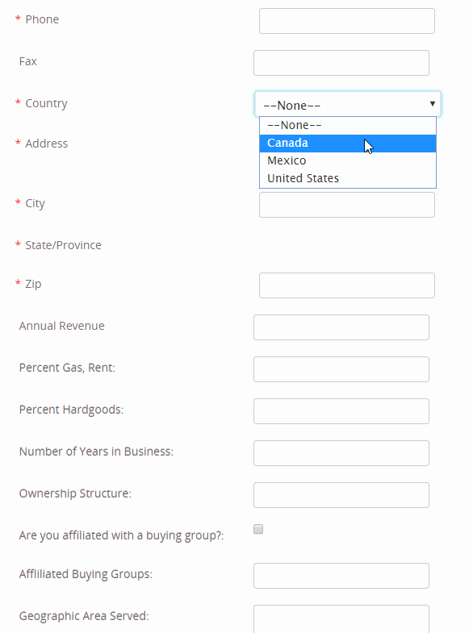

# Intern Program Brings Problem-solving Skills

## First Bugs: Update IWDC Member User form
[link](https://www.iwdc.coop/membership-information/become-a-member)
* Problem from Clients: Lela needs the Canandia state to populate when country is selected. In the example she sent, the user chose Montreal and Iowa was added at the Company State. Picture included.
* Problem I confirm: 

* Solution
* Code

<figure class="highlight"><pre><code class="language-js" data-lang="js"><table class="rouge-table"><tbody><tr><td class="gutter gl">
</td>
<td class="code">
<pre>

   
</pre></td></tr></tbody></table></code></pre></figure>

* Result

