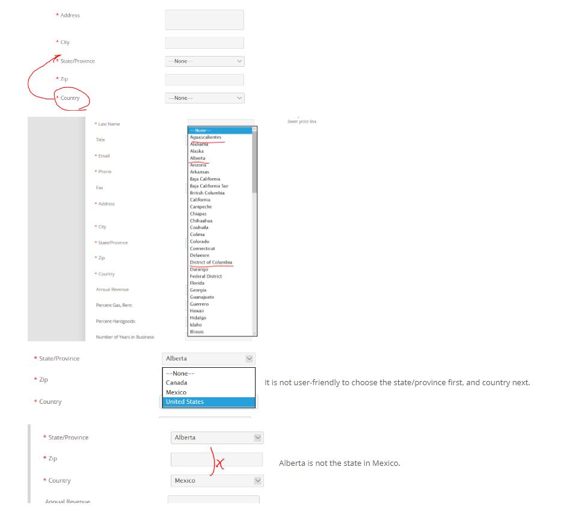
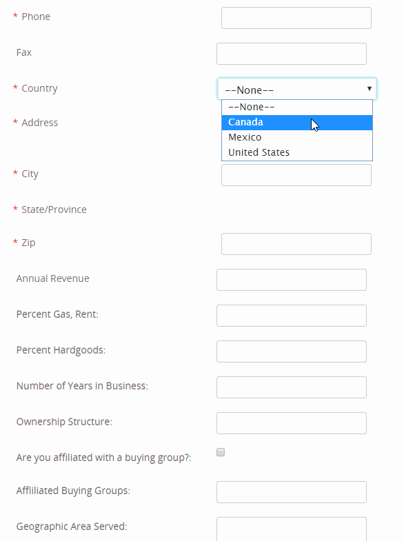
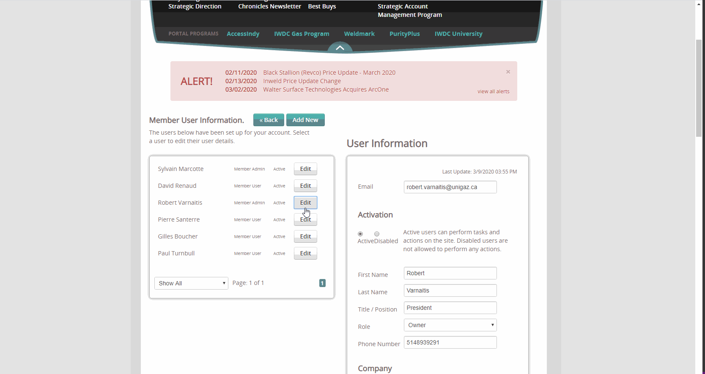
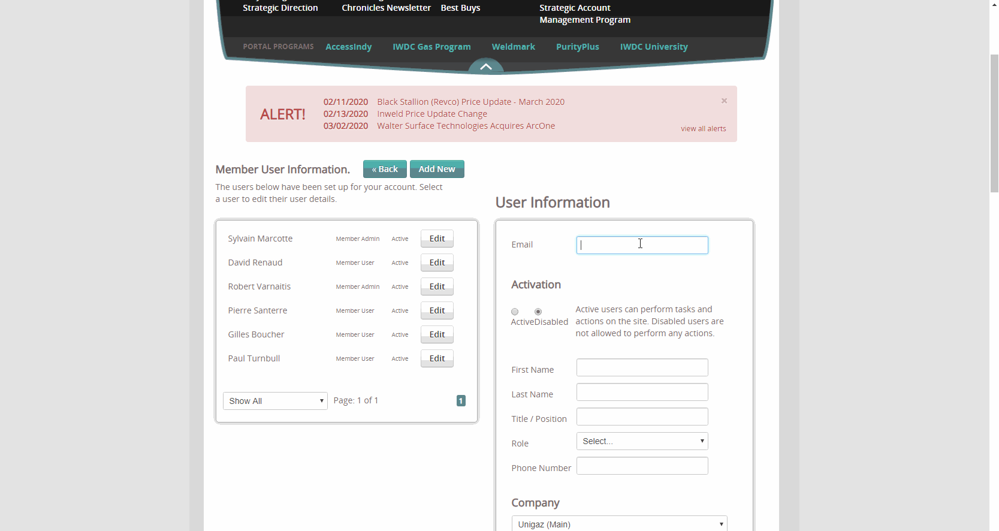

# Software Developer Internship

@ CirrusABS, Fort Wayne, IN. January 21st, 2020 - Current (2 months) 

|  Duration   |         Date          |                                          My Tasks                                            |
|:------------|:----------------------|:---------------------------------------------------------------------------------------------|
|    Week1    | 1/21/2020 - 1/24/2020 | Reinforce C# fundamentals, C# Project1(File handling, array, unit tests, using classes)      |
|    Week2    | 1/27/2020 - 1/31/2020 | C# Project2(Interface, Form-based application using data-bound controls, unit tests, TDD)    |
|    Week3    |  2/3/2020 - 2/7/2020  | X Path Query, XSLT, XML, Regex, URL Rewrites Rules, SEO Friendly URL, Cirrus Web Basics*     |
|    Week4    | 2/10/2020 - 2/14/2020 | WordPress Installation, C# Course Review, C# Project 3(Polymorphism), C# Project 4(MVC)      |
|    Week5    | 2/17/2020 - 2/21/2020 | C# Project 5(Inheritance, Polymorphism, Interface and abstract classes, utilize unit testing)|
|    Week6    | 2/24/2020 - 2/28/2020 | Project 'Bugs' Assigned*, Google Structure Data Testing Tool, Breadcrumb Schema Errors       |
|    Week7    |  3/2/2020 - 3/6/2020  | DB environment setup, IWDC'Become a member'&'Member account form' Country/State Dropdown     |
|    Week8    |  3/9/2020 - 3/13/2020 | Learn .NET 3.5, jQuery, XSLT, CirrusFramework, smtp4dev, Shadow Eddie for Cluster migration  |

*Cirrus Web Developer Basics [Previous Post](https://happygoals.github.io/haemin-ryu-devlog/2020-02-21/Being-a-software-developer-intern)
*Project 'Bugs' Assigned: Confirm whether it is a problem or not and suggest the solution

## What I have learned during internship as a web developer so far
* Languages: C#, ASP.NET Framework, jQuery, JavaScript, XSLT, XML, CirrusFramework
* Site Management: 
1. Internal and external server environment
2. SVN source control
3. DNS Management(DNSME)
4. Database snapshot for backup (Restore Local Website Database), How to copy DB from one to another, How to use the DB Script file(sql) on the command prompt
5. How to synchronize the development site with the production site
* How to use logfile.txt for debugging
* Filezila file version control 
* Version control on visual studio with .dll file from local bin directory to live bin directory
* Visual Studio shortcuts 
* How to use developer tool(F12) on Chrome with Console and how to inspect the elements 

## First Bugs Fixing: Update IWDC Member User form
[link](https://www.iwdc.coop/membership-information/become-a-member)
### Problem from client's request:
* The Canandian state to populate when country is selected. For excample, the user chose Montreal and Iowa was added at the Company State. It should be fixed.
### Problem I confirmed: 
The state populating issue by country selection

### Idea Brainstorming
Jon's idea for IWDC dropdown to get the selected states was to create HTML element to read the state when the user hit the submit button 
Eddie's idea for IWDC dropdown to get the selected states to make 3 different dropdown lists first and use Show() and Hide() depends on the selection on country dropdown button. State dropdown to the value of the country dropdown. My idea was to get selected value on the state dropdown button list and set the initial state on the dropdown list as the original state value from location xml file (as a pre-selected option of dropdown in jQuery). 

### Solution
I initially thought the address order is correct because the order of the address input forms was intentionally aligned by the general American style address format. However, as a user perspective, I changed my mind about the address form order. I would like to suggest it to change the order to select the country first and then the state/province. Then, the state/province can populate when country is selected. 
### Implementation with jQuery, .Net Framework 3.5, xslt, Cirrus Framework, smtp4dev
[jQuery Code](https://happygoals.github.io/takeaways/jquery/jquery-with-dotnet)

### Result

